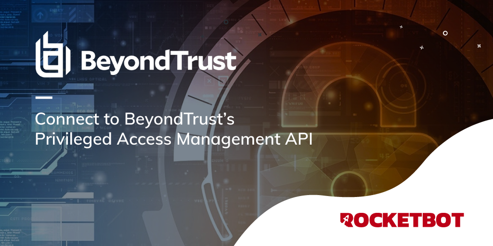

# BeyondInsight
  
BeyondInsight is BeyondTrust’s platform for centralized management, reporting, and threat analytics for privilege access management  
  

## How to install this module
  
__Download__ and __install__ the content in 'modules' folder in Rocketbot path  

## How to use this module
To use this module, you must have a valid BeyondInsight license.

To integrate part of BeyondInsight's API into your applications ou need an API key.

The key is generated by BeyondInsight.

1. Select Configuration > General > API Registrations.
2. Enter a name for the registration.
3. Click Create New API Registration to create a new application registration.

BeyondInsight generates a unique identifier (API Key) that the calling application provides in the authorization header of the web request.

Note: The API Registration page is only available to BeyondInsight administrators.

## Description of the commands

### Set credentials
  
Set credentials to make available the API
|Parameters|Description|example|
| --- | --- | --- |
|API Key ||c479a66f...c9484d|
|Username||Admin|
|Server||htpps://localhost:5001/|

### Get passwords
  
Get all passwords
|Parameters|Description|example|
| --- | --- | --- |
|Result||result|
