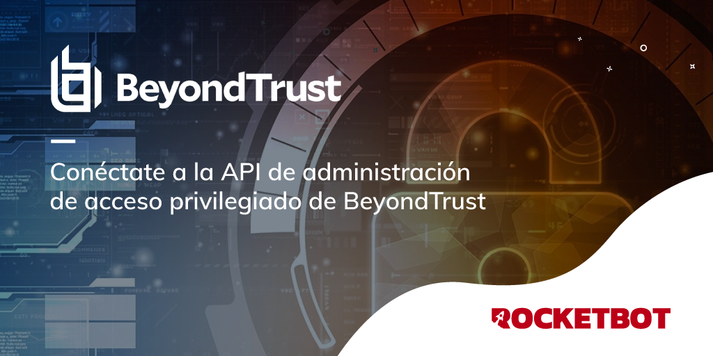

# BeyondInsight
  
BeyondInsight es la plataforma de BeyondTrust para administración centralizada, generación de informes y análisis de amenazas para la administración de acceso privilegiado
  

## Como instalar este módulo
  
__Descarga__ e __instala__ el contenido en la carpeta 'modules' en la ruta de Rocketbot.  

## Como usar este modulo
Para usar este módulo, debe tener una licencia válida de BeyondInsight.

Para integrar parte de la API de BeyondInsight en sus aplicaciones, necesita una clave de API.

La clave la genera BeyondInsight.

1. Seleccione Configuración > General > Registros de API.
2. Introduzca un nombre para el registro.
3. Haga clic en Crear nuevo registro de API para crear un nuevo registro de aplicación.

BeyondInsight genera un identificador único (clave API) que proporciona la aplicación que llama en el encabezado de autorización de la solicitud web.

Nota: La página de registro de la API solo está disponible para los administradores de BeyondInsight.

## Descripción de los comandos

### Establecer credenciales
  
Establece las credenciales para tener disponible la API
|Parámetros|Descripción|ejemplo|
| --- | --- | --- |
|API Key ||c479a66f...c9484d|
|Nombre de usuario||Admin|
|Servidor||htpps://localhost:5001/|

### Obtener contraseñas
  
Obtiene todas las contraseñas
|Parámetros|Descripción|ejemplo|
| --- | --- | --- |
|Resultado||result|
