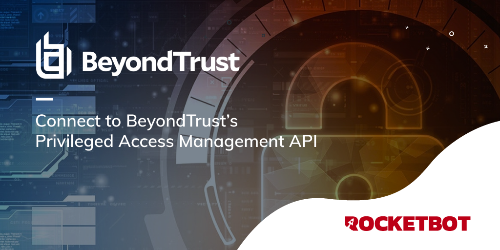

# BeyondInsight
  
BeyondInsight é a plataforma da BeyondTrust para gerenciamento centralizado, relatórios e análise de ameaças para gerenciamento de acesso privilegiado  
  

## Como instalar este módulo
  
__Baixe__ e __instale__ o conteúdo na pasta 'modules' no caminho do Rocketbot  

## Como usar este módulo
Para usar este módulo, você deve ter uma licença válida do BeyondInsight.

Para integrar parte da API do BeyondInsight em seus aplicativos você precisa de uma chave de API.

A chave é gerada pelo BeyondInsight.

1. Selecione Configuração > Geral > Registros de API.
2. Digite um nome para o registro.
3. Clique em Criar novo registro de API para criar um novo registro de aplicativo.

O BeyondInsight gera um identificador exclusivo (chave de API) que o aplicativo de chamada fornece no cabeçalho de autorização da solicitação da web.

Observação: a página de registro da API está disponível apenas para administradores do BeyondInsight.

## Descrição do comando

### Definir credenciais
  
Defina as credenciais para ter a API disponível
|Parâmetros|Descrição|exemplo|
| --- | --- | --- |
|API Key ||c479a66f...c9484d|
|Nome de usuário||Admin|
|Servidor||htpps://localhost:5001/|

### Obter senhas
  
Obter todas as senhas
|Parâmetros|Descrição|exemplo|
| --- | --- | --- |
|Resultado||result|
